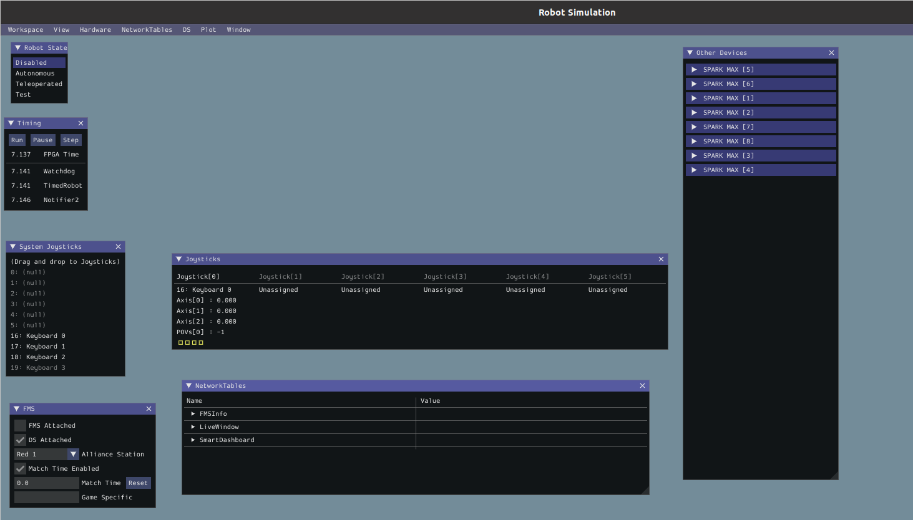
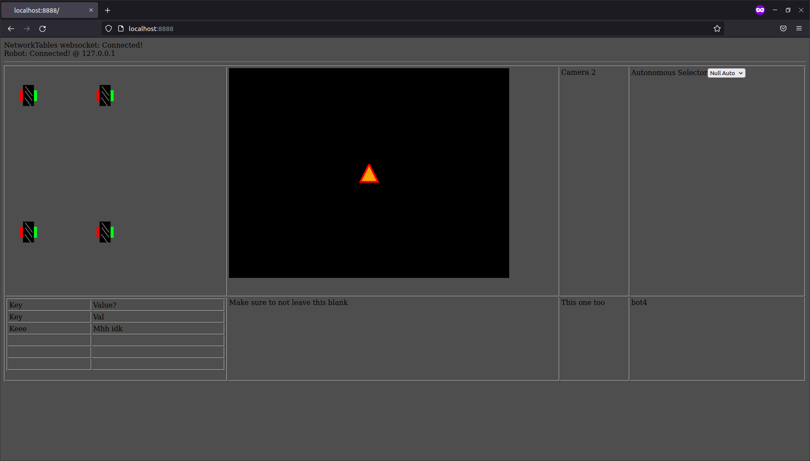

Developing
##########

.. include:: ../resources/resources.rst

Configuration Files
===================

|pitcrew| |software|

.. warning::
   Make sure this manual's revision hash and the robot hash match!

This is literally the robot hardware configuration written in yaml.

These are provided as reference for use by pit crew.

Use this to confirm/reconfigure motor controller addresses or examine
if pose x/y cords match actual.

.. literalinclude:: ../../rio/constants/robot_hardware.yaml
  :language: YAML

Getting started modifying these docs
====================================

|software|

Requirements for building the docs
----------------------------------

You'll need to install several packages to build these docs

.. code-block:: shell
   
   # Ubuntu/Debian users
   sudo apt install texlive-latex-recommended texlive-latex-extra texlive-pictures pandoc rename latexmk

Making the docs
---------------

Under the ``Docs`` directory in ``pre2022season``, setup a pipenv using the 
provided files and invoke the ``make latexpdf`` command to build the docs.

.. code-block:: shell

   pipenv install # May take a while
   pipenv shell
   make latexpdf # Builds the manual

Find the generated ``.pdf`` under ``docs/_build/latex/``
it is recommended that you also have a restructured text interperter such as reStructuredText.
Documentation can be found at (https://sublime-and-sphinx-guide.readthedocs.io/en/latest/setup.html)

Git
---

While most git commands are in git documentation (https://git-scm.com/doc),
here are a few basic commands you should know.

#. Git clone (https)
#. git add -A
#. git status
#. git commit -m "message"
#. git push
#. git pull
#. git checkout (hash)
#. git stash
#. git branch ""new branch name"

Explanations:

#. git clone (https) clones a repository for you to use yourself, the https you can find by going to a github repository and clicking code the first option should be https. Copy that and then run the command.
#. git add -A adds all changes to the version you would commit.
#. git status tells you what files are changed and not yet added with git add
#. git commit -m "message" puts all changes added into a commit with a message that you made.
#. git push makes all commits a new version, git push -m "message" adds a message that you made.
#. git pull changes your code to be with the most recent version.
#. git checkout lets you change branches.
#. git stash commands

   * git stash, stashes you current changes
   * git stash apply, apply your stashed changed
   * git stash drop, clears the current stashed changes
#. git branch "new branch name", is how to add a new branch using git

Examples for each in order are:

.. code-block:: shell

   git clone https://github.com/FRC-1721/pre2022season.git
   git add -A
   git status
   git commit -m "added git subsection"
   git push
   git pull
   git checkout 13020ab
   git stash
   git stash apply
   git stash drop
   git branch "DevDocs"

Robot Simulator
===============

|software|

Requirements
------------

Under the ``rio`` directory setup a pipenv using the provided files
and invoke the ``make sim`` command to run the simulator.

.. code-block:: shell
   
   pipenv install # May take a while
   pipenv shell
   make sim # Alternatively run: python3 robot.py sim

This will start the robot simulator. See :ref:`Using the Simulator` for more info.

Using the Simulator
-------------------

To be able to "operate" the robot while any mode will work it 
is recommended that under robot state, Teleoperated is enabled.

Under the Joysticks there will be Joysticks 1-5 all grayed out,
to select one go to System Joysticks and drag on over.

When starting up the program there will be no input method
selected under System Joysticks there may be Joysticks,
Xbox controllers, or Keyboards 0-3.

Joysticks and Xbox controllers work as if piloting an actual robot.

Keyboard 0 is the WASD keys to move and E and R to rotate the controller.

Keyboards 1-3 are differing controller schemes that are useless for 
the purposes of testing due to lack of movement.

Keyboard inputs require you to have the active window be the simulator 
while, Joysticks and xbox controllers don't.

Dashboard
=========

|software| |driveteam|

Dashboard Requirements
----------------------

under the ``dashboard`` directory setup a pipenv using the provided files
and invoke the ``make run`` command to start the Dashboard's local host.

.. code-block:: shell

   pipenv install # May take a while
   pipenv shell
   make run # makes a local hosted website dashboard

This will start the website dashboard. See :ref:`Using the Dashboard` for more info.

Using the Dashboard
-------------------

Activating the dashboard doesn't automatically start. To start the Dashboard within your terminal it will print

.. code-block:: shell

   cd www && python -m pynetworktables2js
   16:32:28:683 INFO    : dashboard           : Connecting to NetworkTables at Ip address
   16:32:28:683 INFO    : nt                  : NetworkTables initialized in client mode
   16:32:28:683 INFO    : dashboard           : NetworkTables Initialized
   16:32:28:684 INFO    : dashboard           : Listening on http://localhost:8888/
   16:32:28:978 INFO    : tornado.access      : 101 GET /networktables/ws (Ip address) 0.89ms
   16:32:28:978 INFO    : net2js              : NetworkTables websocket opened

Within this you will see one called local host, you will need to copy that link and put it in a web browser.
It is recommened that you use this in incognito due to network cache causing issues with not updating.

.. remember to update png as software is updated ..

This will auto conntect to the simulation if one is running, if
you start one after remember to refresh the page.

For this station to active things such as the swerve drive wheels,
the simulation must be set to Teleoperated see :ref:`Using the Simulator`.

In the top left there will display a simulation of the swerve drive wheels.

To see the simulation of the swerve drive you first must turn the wheels.

In the top right there is an autonomous selector where autonomous may be selected.

There is also a camera that are on the bot.

Robot code
==========

|software|

Deploying code
--------------

First remember to have the :ref:`FRC Driver Station` open first otherwise this won't work properly.

To deploy robot code first go to the ``rio`` setup a pipenv
and invoke the ``make deploy``

.. code-block:: shell

   pipenv install # this may take some time
   pipenv shell
   make deploy # this run python3 robot.py deploy

First time running it will ask for a team number (1721). After the first time it will know the team number deploy the code.

FRC Driver Station
------------------

The FRC Driver Station is made for windows, but there is a linux version 
Q Driver Station.

This will assume your using the windows version but they both should be the same.

While most of this will be not in your control during competitions but this 
will go over it all.

The base mode is Teleoperated but you can also set it to Autonomous.

You can enable the robot after a joystick is detected, make sure to plug one 
in it had robot code and has communications with the robot.

You may also change which Team Station your at, this changing nothing, unless
something like the candle changes color based on team.

Also see :ref:`Dashboard` for a dashboard.
