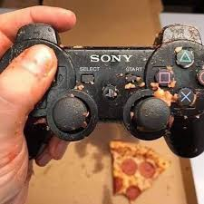

Introduction
============

.. include:: ../resources/resources.rst

|outreach|

.. warning::
   Make sure this manual's revision hash and the robot hash match!

.. This centers the Welcome and Thanks for Reading text ..
.. yes I know this is stupid ..
.. don't touch it ..

.. update image with image of completed robot ..

This manual details everything about **Burnt Toaster** from the
prototyping and testing to the grity technical details that make our
bot tick!

If you're reading to get an idea of how our bot works, check out technical
chapters like :ref:`Robot Network Architecture` or :ref:`Developing`.

If you're reading to get an idea of how our team operates on a technical level
check out chapters like :ref:`Critical Design Review` and see the subsystems for prototyping.
