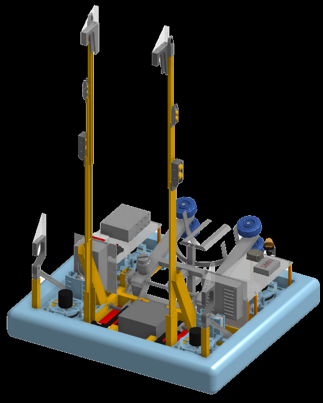

The Climber Subsystem
#####################

.. include:: ../resources/resources.rst

Introduction
============

|outreach|

  An idea for the robot climber

We had a very different idea for our climber at first,
but after several redesigns we ended up with our final climber.

Our final climber design was simmilar to drawer sliders,
the robot's climber would also pull its self up simmilar to a pull up.

For more detail and previous ideas see :ref:`Prototyping`.

Prototyping
===========

|outreach|

Servicing
=========

|pitcrew|
