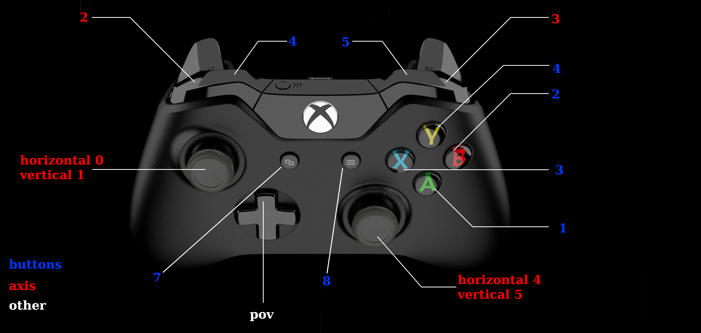
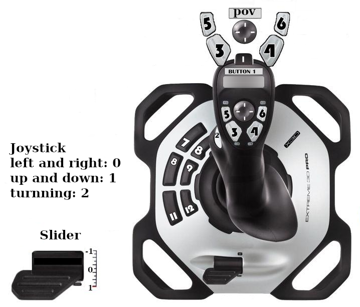

Operating and Controls
######################

.. include:: ../resources/resources.rst

Controller Map
==============

|driveteam|

.. literalinclude:: ../../rio/constants/robot_controls.yaml
  :language: YAML

While the most of the image is self explanitory or common knowledge
I.E. the joysticks being able to go from 1 on the right and -1 on the left.

The triggers are only able to go from 0 to 1, and the LB and RB are buttons,
with the blue logitech controller the pov and left joystick are switched.

The standard controller that we use the logitech joystick, most should have knowledge on how this works.

This controller have being used the most in previous years, it might no be used as much in previous years.
