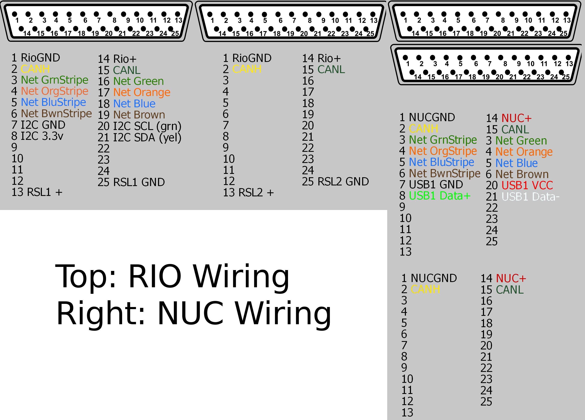

Robot Wiring
############

.. include:: ../resources/resources.rst

The robot contains almost 50+ ft of wire in many gauges
and many styles. This section details the wiring harness,
connectors, and important servicing information.

Full Electrical Schematic
=========================

|outreach| |pitcrew|

Shared Connectors
=================

|pitcrew|

Some processors or subsystems use large, multi pin connectors
to connect to the central wiring harness, they are detailed below.

